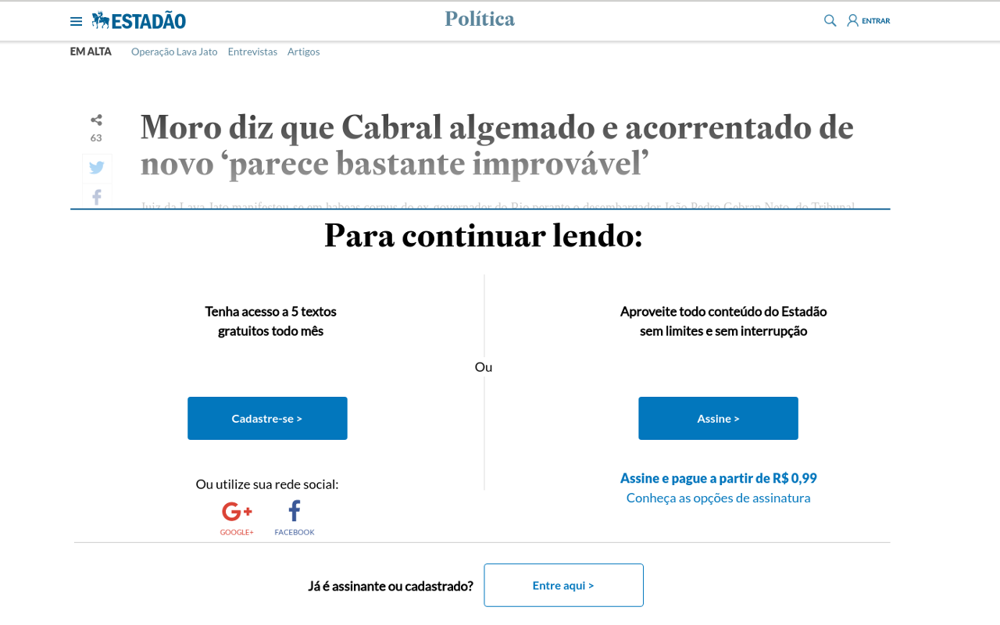
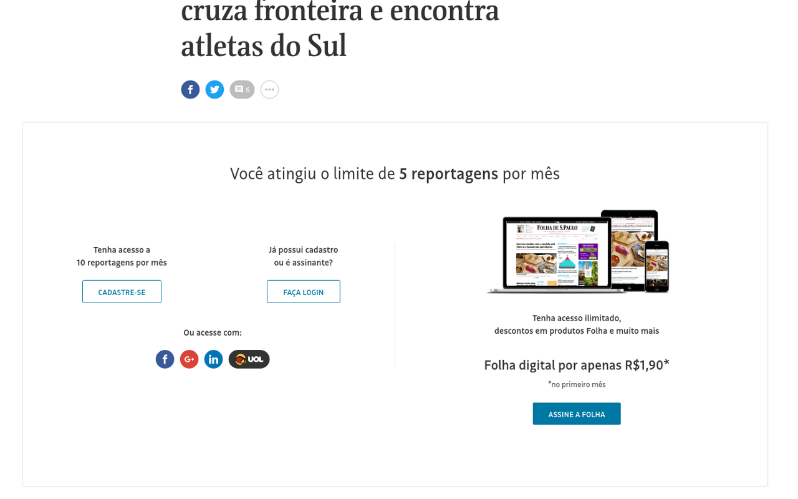

  

# :newspaper: FreeNews 

Extensão de navegador que desbloqueia acesso à notícias da Folha de São Paulo e Estadão.

## O que é?
:no_entry_sign:  
"Você atingiu o limite de 5 reportagens por mês"  
"Conteúdo restrito a assinantes e cadastrados"  
"Para continuar lendo, cadastre-se ou assine"  

Estas frase são comuns quando estamos navegando em sites de notícia como a Folha de São Paulo e Estadão.
Com esta extensão para o navegador você poderá ler quantas notícias quiser sem nenhum bloqueio.

## Como instalar? 

[Instalar no Chrome](https://chrome.google.com/webstore/detail/freenews/ilajhcjodkeegpgkbgojhplgddmajenp)

## Como funciona?

Ao instalar a extensão no seu navegador, ela irá bloquear que o Estadão e a Folha de São Paulo verifiquem se você é um usuário assinante e a partir disso impedir que você leia o conteúdo de uma notícia. Sem essa verificação vocẽ poderá ler as notícias tranquilamente.

## Quero liberar notícias de outros sites?
Está extensão é uma prova de conceito de como é possível e simples desbloquear o acesso às notícias dos sites. Se você quiser liberar para vários sites, recomendo a extensão [Burlesco](https://burles.co/), ela é continuamente atualizada com diversos sites de notícias. Caso não queira usar outra extensão, pode entrar em contato em sugerir sites para serem adicionados à esta extensão.

## Como posso contribuir?
O código desta extensão é bem simples, caso consiga descobrir mais sites que usem o mecanismo de Paywall e descubra as URLs de verificação, você pode adicionar fácilmente no código e contribuir com um Pull Request. Se desejar desenvolver, mesmo que para estudo, outras formas de desbloquear portais de notícias, fique à vontade também. Sua contribuição será considerada.

## Exemplos

Estes avisos aparecem após ler algumas notícias nos sites. Com esta extensão isso não irá mais acontecer.

  

  

 